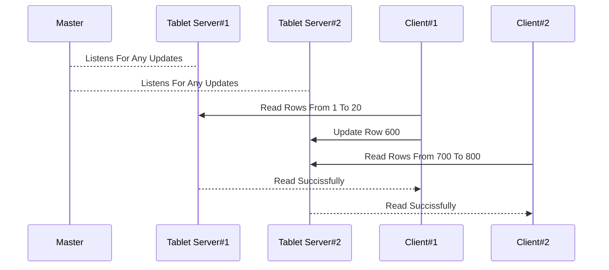
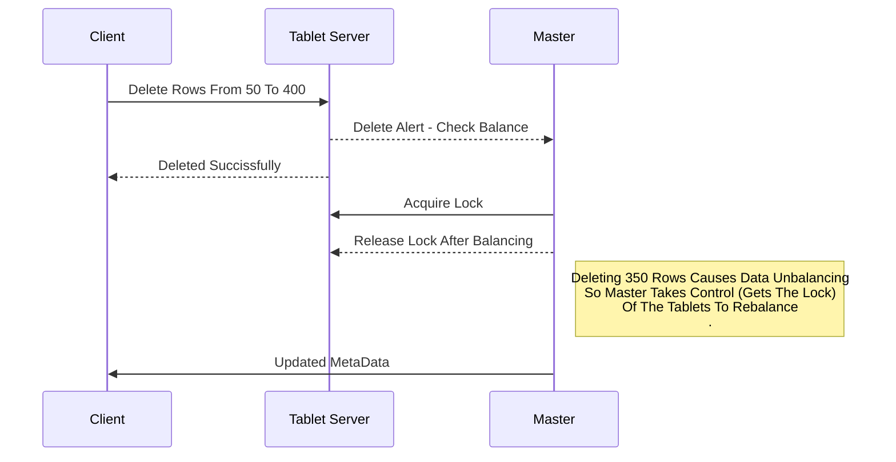

# Distributed System - BigTable

Distributed system for managing structured data that is designed to scale to a very large size.

## Data Model

The data this system manages consists of One BigTable that is sharded into        
3 tablets divided by Row Key , Each tablet is assigned a key range of data .

## System Components

The system consists of 3 major components : 
 1. One Master Server
 2. Two Tablet Servers
 3. Many Clients

## Master Server	

  - Tablets Assignment
  - Listens For Any Updates Requests And Checks For Balancing
  - Blances Data between the 3 Tablets Whenever Necessary
  - Updates Metadata And Resends It To The Clients
  - Manages Logs For The Whole System In A local File System

## Tablet Servers	

  - Each Tablet Server Manages One Or Two Tablets
  - Provides API For Clients
  - Handles Multiple Requests At A Time (Locking)
  - Sends Updates Periodically To Master
  - Sends Its Logs To Master Periodically
  
## Client	

  - Sends Requests To Tablet Servers Based On The Provided API
  - Manages Sending Requests To The Right Tabler Server Based On The Provided MetaData

  

|API Functions|
|--|
| Read Row/s |
| Delete Row/s |
| Update Row/s |
| Delete Row/s Field/s |
| Insert Row/s |

## Sample Examples

## Tools

- Nodejs
- Mongodb
- Socket.io
- Async-Mutux

## Contributors
<table>
  <tr>
    <td align="center">
    <a href="https://github.com/nadaabdelmaboud" target="_black">
    <b>Nada Abdelmaboud</b></a>
    </td>    
    <td align="center">
    <a href="https://github.com/MENNA123MAHMOUD" target="_black">
    <b>Menna Mahmoud</b></a>
    </td>   
        <td align="center">
    <a href="https://github.com/hagerali99" target="_black">
    <b>Hager Ismael</b></a>
    </td>   
        <td align="center">
    <a href="https://github.com/Nihal-Mansour" target="_black">
    <b>Nihal Mansour</b></a>
    </td>   
        <td align="center">
    <a href="https://github.com/ayaadelhassan" target="_black">
    <b>Aya Adel</b></a>
    </td>   
  </tr>
 </table>

## License

> This software is licensed under MIT License, See [License](https://github.com/nadaabdelmaboud/BigTable/blob/main/LICENSE)
